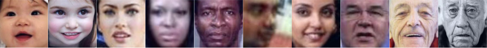

# Ammon Brock
**Data Scientist | MS Computer Science | BS Applied Mathematics**

Check out my resume for work experience and education details!

  <a href="march_2026_resume.pdf" target="_blank" rel="noopener noreferrer" style="background-color: #0366d6; color: white; padding: 10px 20px; text-decoration: none; border-radius: 5px; font-weight: bold;">
    📄 View Full Resume (PDF)
  </a>

  

## Featured Projects

### MATCH: Client-Therapist Matching with Machine Learning

I co-authored <a href="https://doi.org/10.1080/10503307.2025.2599248" target="_blank" rel="noopener noreferrer">this paper</a>, published in the *Psychotherapy Research* journal, detailing how machine learning can be used to improve client-therapist assignments. 

**Key Contributions**
- **Predictive Modeling:** Trained a Random Forest algorithm to predict therapy outcomes for specific patient-therapist pairings based on patient intake data (gender, age, baseline distress levels).
- **Outcome Optimization:** Designed a matching algorithm utilizing these predictions to optimize therapist assignments, maximizing overall expected therapy outcomes across a clinic.
- **Real-World Application:** Incorporated strict scheduling constraints for both patients and therapists into the model, proving that the algorithm consistently improves expected outcomes even under rigid real-world limitations.

### Multi-Modal Embeddings: Semantic Image Sorting

I trained a custom CLIP (Contrastive Language-Image Pre-training) model on 1.2 million image-caption pairs, achieving performance that exceeds the original CLIP model on multiple benchmarks. The model learns joint embeddings of images and text, enabling powerful semantic understanding and comparison. I also created novel evaluation metrics and applications of the model as detailed in the <a href="custom_clip_report.pdf" target="_blank" rel="noopener noreferrer">technical report</a>.

**Key Achievements**
- Successful training of a large scale (1.2 million training examples) multi-modal model
- Developed a novel application of the trained model (using a difference vector from 2 captions to sort a dataset of images)
- Unique evaluation metric that measures the accuracy of the projections onto the semantically defined lines

#### Example Applications
Zero-shot sorting of facial images from "a very young baby" to "an extremely old man"

See the <a href="custom_clip_report.pdf" target="_blank" rel="noopener noreferrer">technical report</a> for detailed information about how we used ground truth ages on a large dataset of faces to measure its accuracy on this task.

Zero-shot sorting of pictures of myself from "a very ugly man" to "an extremely attractive man"

Zero-shot sorting of pictures of myself from "a man that is bored" to "a man having fun"

Check out the code yourself! <a href="https://github.com/AmmonBrock/custom-clip.git" target="_blank" rel="noopener noreferrer">Custom Clip Code</a>

### Parapal: An LLM-Based Grading Assistant for Teachers

I worked with 2 classmates to create a website that automatically grades student essays according to specified rubrics and common core standards. We built it to autoscale on AWS so it could handle real-world usage demands. Out of respect for co-founders who intend to pursue this project as a business endeavor, I do not include the code. However, I do include a short demo video of the website. Check it out!

  <iframe width="560" height="315" src="https://www.youtube.com/embed/1aKSF8OVZsM" frameborder="0" allowfullscreen></iframe>

**Key Achievements**
- Deployment of an LLM-based website using the following tools on AWS: S3, CloudFront, Cognito, API Gateway, Lambda, and Bedrock
- Rigorous parsing and validation of LLM responses to ensure correct format
- Cost estimations of deployment architecture and design of a feasible business plan

